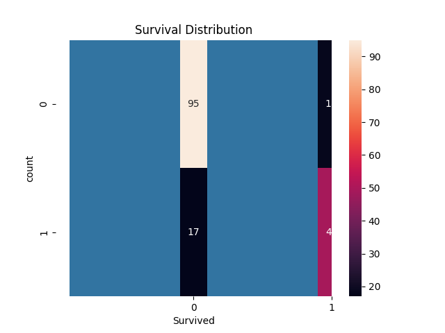
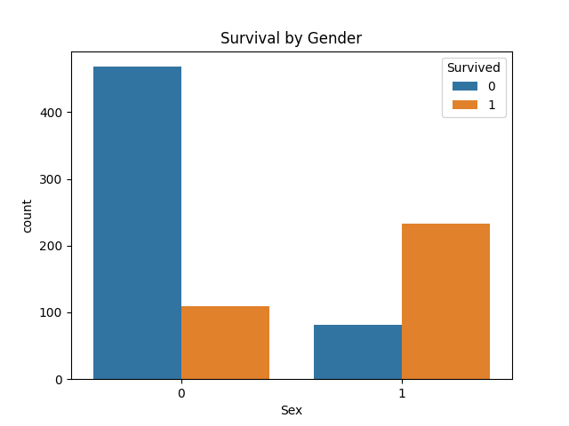
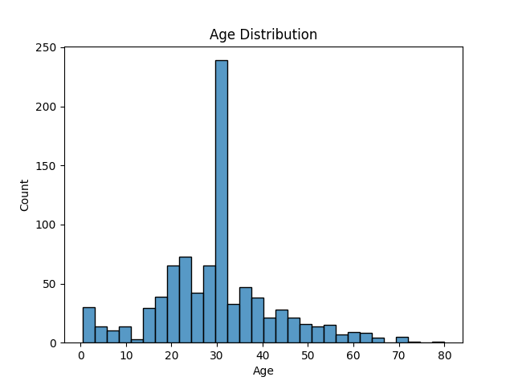
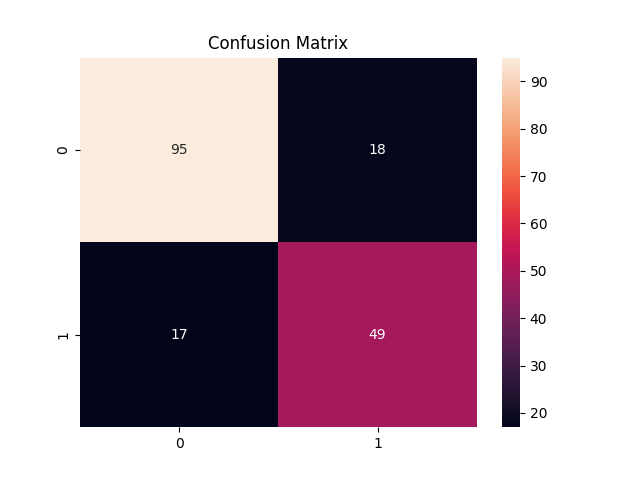

# Titanic Survival Prediction
## Overview
This project predicts whether a passenger survived the Titanic disaster using Machine Learning.

## Technologies Used
- Python
- Pandas
- NumPy
- Scikit-learn
- Matplotlib
- Seaborn

## Model
Random Forest Classifier

## Accuracy
~81%

## Features Used
- Pclass
- Sex
- Age
- Fare
- SibSp
- Parch

## Visualizations

### Survival Distribution

### Gender Survival

### Age Distribution

### Confusion matrix heatmap

  
 ## Author
-  Sai Prashanth
